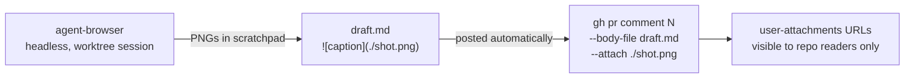

# Stagehand / Browserbase for `/to-pr` proof uploads

Researched 2026-10-07 against `to-pr/references/visual-proof.md` § A5.

**Answer.** Stagehand and Browserbase would barely simplify this: they trade the local logged-in browser for another logged-in browser (a Chrome profile or a cloud context) that still needs a hand login with 2FA, stays bound to GitHub's comment-box DOM, and adds LLM or cloud costs. The simplification arrived on 2026-09-01: `gh` v2.99.0+ uploads images into PR comments with `gh pr comment <n> --body-file <f> --attach <png>`, using the token `gh` already holds, private repos included. Upgrade `gh` and drop the `github` browser session from A5 entirely.

**Outcome (2026-10-07).** Adopted: `gh` upgraded 2.89.0 → 2.102.0, A5 rewritten to `--attach`, the saved `github` browser login deleted, and proof now posts automatically without waiting for approval.

## A5's two constraints, re-checked

| Claim in A5 | Status on 2026-10-07 | Source |
|---|---|---|
| "There is no comment-image API" | **Outdated.** `gh` v2.99.0 (2026-09-01) added a repeatable `--attach` to `gh pr comment`, `gh issue comment`, and `pr`/`issue` `create`/`edit`. It calls `POST uploads.github.com/user-attachments/assets?repository_id=…`, which accepts OAuth/PAT tokens. That endpoint is absent from the REST reference, and no GraphQL mutation exists; `gh` is the supported door. | https://github.com/cli/cli/releases/tag/v2.99.0 · https://github.blog/changelog/2026-09-01-github-cli-media-in-issues-pull-requests-and-comments/ · https://github.com/cli/cli/issues/14309 · https://github.com/github/roadmap/issues/1324 |
| "A committed raw URL breaks behind camo in private repos" | **Contradicted by GitHub docs.** Camo proxies *externally hosted* images. GitHub's own table gives `../blob/main/<path>?raw=true` as the form for "issues, pull requests and comments of the repository", and says it works in a private repo for viewers with read access. What does fail: `raw.githubusercontent.com` URLs (404 for private repos) and any auth-gated image in email notifications. Not live-tested here. | https://docs.github.com/en/authentication/keeping-your-account-and-data-secure/about-anonymized-urls · https://docs.github.com/en/get-started/writing-on-github/getting-started-with-writing-and-formatting-on-github/basic-writing-and-formatting-syntax#images · https://github.com/github/awesome-copilot/blob/main/skills/github-issues/references/images.md |

## Comparison

| Option | Removes login step? | Removes headed browser? | Deterministic? | Extra cost | Security exposure | Effort to adopt | Source |
|---|---|---|---|---|---|---|---|
| **Current**: agent-browser `github` session (A5) | No. Hand sign-in + 2FA whenever the cookie lapses | No | Selector-bound (`#fc-new_comment_field`); browser restarts if launch options drift | None | Full GitHub session cookie in a plaintext JSON state file unless `AGENT_BROWSER_ENCRYPTION_KEY` is set | Already built | `to-pr/references/visual-proof.md` · https://github.com/vercel-labs/agent-browser (README, State files note) |
| **Stagehand v4, local** (`localBrowser.launch({ userDataDir })`) | No. Same one-time hand login, kept in a profile dir | No for the login (`headless: false`); headless afterwards | `locator().setInputFiles()` is plain code; `act()`/`observe()` instructions run an LLM call each. Caching is a no-op locally | LLM tokens on your own provider key (Model Gateway is Browserbase-only) | Full Chrome profile dir on disk, same class as today | New Node/Python/Go dependency and script replacing a working CLI flow | https://docs.stagehand.dev/v4/best-practices/user-data · https://docs.stagehand.dev/v4/reference/locator · https://docs.stagehand.dev/v4/best-practices/caching |
| **Stagehand + Browserbase** (Context + Live View) | No. One hand login through Live View (cloud browser is a "new device", so 2FA), then the Context persists until GitHub expires the cookie | Yes locally (browser runs in the cloud; Live View still needed for the login) | Cached `act()` replays "deterministically with self-healing turned off"; falls back to inference if the selector breaks | Free: 1 browser-hour/mo, 15-min sessions. Developer $20/mo: 100 h. Tokens at provider price | GitHub session stored by a third party (encrypted at rest). Recording and logging default **on**, so the login and PR pages are captured; 7-day retention on Free/Developer | Account, API key, Context lifecycle, file transfer (payload or Session Uploads API) | https://docs.browserbase.com/platform/browser/core-features/contexts · https://docs.browserbase.com/platform/identity/authentication · https://docs.browserbase.com/account/billing/plans · https://docs.browserbase.com/reference/api/create-a-session |
| **`gh pr comment --attach`** (gh ≥ 2.99.0) | **Yes.** Reuses the `gh auth login` OAuth token | **Yes.** No browser at all | Yes. One CLI call, no DOM | None | No new secret. Needs push access. GitHub App / Actions `GITHUB_TOKEN` rejected | `brew upgrade gh`, then A5 becomes one command | https://docs.github.com/en/github-cli/github-cli/attaching-files-with-github-cli · https://cli.github.com/manual/gh_pr_comment |
| `gh image` extension (community) | Yes for writable repos (delegates to `gh`'s token); otherwise reads the browser `user_session` cookie | Yes | Yes | None | Fallback reads a full-account `user_session` cookie from the browser store | `gh extension install drogers0/gh-image`. Adds nothing over `--attach` here | https://github.com/drogers0/gh-image |
| Commit PNGs to an assets/orphan branch, embed `blob/<sha>/x.png?raw=true` | Yes | Yes | Yes | None | Screenshots become permanent git objects visible to every repo reader | Low; extra branch/commits; no email rendering; untested live | https://docs.github.com/en/get-started/writing-on-github/getting-started-with-writing-and-formatting-on-github/basic-writing-and-formatting-syntax#images |
| Release assets | Yes | Yes | Yes | None | Creates releases/tags in the repo. `gitshot` defaults to a **public** repo, leaking private UI | Low | https://github.com/vipulgupta2048/gitshot |
| Secret gist | Yes | Yes | Yes | None | Rejected: "Secret gists aren't private"; anyone with the URL sees it | Low | https://docs.github.com/en/get-started/writing-on-github/editing-and-sharing-content-with-gists/creating-gists |
| **User's Chrome**: Claude in Chrome | Yes (shares Chrome's logins) | No (visible real Chrome window) | Model-driven; upload path has a breakage history | Included in a claude.ai plan (API-key auth disables it) | Agent acts inside the real browser, gated by per-site permissions | Extension + `claude --chrome`; 10 MB per upload | https://code.claude.com/docs/en/chrome · https://github.com/anthropics/claude-code/issues/73161 |
| **User's Chrome**: agent-browser `--auto-connect` / `--cdp` | Yes (reuses the running Chrome's session) | No | Same selectors as today | None | Chrome 136+ ignores `--remote-debugging-port` on the default profile; Chrome 144+ toggle at `chrome://inspect/#remote-debugging` asks per connection; any local process can drive the browser | Low; same `upload` command | https://developer.chrome.com/blog/remote-debugging-port · https://developer.chrome.com/blog/chrome-devtools-mcp-debug-your-browser-session · https://github.com/vercel-labs/agent-browser |

## Recommended flow

## Stagehand today

| Fact | Detail | Source |
|---|---|---|
| Version | npm `latest` 4.1.0; `v3-latest` 3.7.3; 4.2.0 alpha | https://www.npmjs.com/package/@browserbasehq/stagehand |
| Primitives | `act`, `extract`, `observe`, plus a Playwright-style `page`/`locator`. **`agent()` removed in v4**, replaced by "code mode" or your own tool loop | https://docs.stagehand.dev/v4/migrations/v3 |
| Local vs Browserbase | Runs locally with installed Chrome (`localBrowser.launch`, or `LocalBrowser.connect({ cdpUrl })` to an existing Chrome) | https://github.com/browserbase/stagehand · https://docs.stagehand.dev/v4/configuration/browser |
| File upload | `locator.setInputFiles()`: "local files or in-memory payloads" | https://docs.stagehand.dev/v4/reference/locator |
| Persistent auth | `userDataDir` locally; Browserbase Contexts in the cloud | https://docs.stagehand.dev/v4/best-practices/user-data |
| LLM per action | Instruction-based `act` runs inference; replaying an `observe()` Action runs "no inference at all". Docs report tokens, not dollars | https://docs.stagehand.dev/v4/basics/act · https://docs.stagehand.dev/v4/best-practices/cost-optimization |
| Caching / self-heal | Server-side only; local `cacheDir` removed in v4; "with a local browser … the `cache` option has no effect". `selfHeal` re-infers a broken selector | https://docs.stagehand.dev/v4/best-practices/caching · https://docs.stagehand.dev/v4/migrations/v3 |
| Model Gateway | Browserbase picks the model, market-price tokens, "does not work with local browsers" | https://docs.stagehand.dev/v4/configuration/models |
| MCP | Hosted Browserbase MCP has 6 tools (`start`, `end`, `navigate`, `act`, `observe`, `extract`), **no upload tool**. Experimental Claude Code "facade" MCP (`run`/`snapshot`/`screenshot`) ships from the repo, local or cloud | https://github.com/browserbase/mcp-server-browserbase · https://docs.stagehand.dev/v4/integrations/cli-agents/claude-code |

## Browserbase

| Fact | Detail | Source |
|---|---|---|
| Contexts | Persist the user-data dir (cookies, storage); "live indefinitely"; "uniquely encrypted at rest"; avoid concurrent sessions on one Context | https://docs.browserbase.com/platform/browser/core-features/contexts |
| Human login / 2FA | Recommended: log in once by hand in Live View, persist via Context | https://docs.browserbase.com/platform/identity/authentication · https://docs.browserbase.com/platform/browser/observability/session-live-view |
| Getting local files in | Playwright `setInputFiles` from a local path; large files via `POST /v1/sessions/{id}/uploads` → `/tmp/.uploads/<name>` + CDP `DOM.setFileInputFiles` | https://docs.browserbase.com/platform/browser/files/uploads · https://docs.browserbase.com/reference/api/create-session-uploads |
| Cookie sync | Skill copies local Chrome cookies (domain-filtered) into a Context; needs Chrome remote debugging | https://docs.browserbase.com/integrations/skills/cookie-sync |
| Retention / recording | 7 days (Free, Developer), 30 days (Startup). `recordSession`/`logSession` default `true`; both can be disabled | https://docs.browserbase.com/account/billing/plans · https://docs.browserbase.com/account/enterprise/security |
| GitHub vs cloud IPs | GitHub re-asks 2FA on "a new device"; device verification applies only without 2FA. No primary source found on GitHub blocking datacenter IPs | https://docs.github.com/en/authentication/securing-your-account-with-two-factor-authentication-2fa/accessing-github-using-two-factor-authentication · https://docs.github.com/en/authentication/keeping-your-account-and-data-secure/verifying-new-devices-when-signing-in |
| agent-browser bridge | agent-browser 0.36.0 already has `-p browserbase` ("All commands work identically") | https://github.com/vercel-labs/agent-browser |

## GitHub upload facts

| Fact | Detail | Source |
|---|---|---|
| `--attach` limits | PNG, JPEG, GIF, WebP, SVG, MP4, MOV, WebM; 10 MB per image; ≤50 files per command; GHES unsupported | https://github.blog/changelog/2026-09-01-github-cli-media-in-issues-pull-requests-and-comments/ · https://github.com/cli/cli/releases/tag/v2.99.0 |
| `--attach` + `--body-file` | Local `` references are rewritten to the uploaded URL; unreferenced files are appended | https://docs.github.com/en/github-cli/github-cli/attaching-files-with-github-cli |
| Private repos | Maintainers tested uploads to a private repo; private attachments are viewable only by logged-in users with repo access | https://github.com/cli/cli/pull/14180 · https://github.blog/changelog/2023-05-09-more-secure-private-attachments/ · https://docs.github.com/en/get-started/writing-on-github/working-with-advanced-formatting/attaching-files |
| Original `gh` issue | #1895 still closed "not planned"; tracked and shipped via #13256 | https://github.com/cli/cli/issues/1895 · https://github.com/cli/cli/issues/13256 |
| Community tools | `gh-image` v1.4.0 (2026-09-08, active, 275★); `gh-attach` v1.7.3 (2026-06-13, 3★; cookie, release-asset, repo-branch strategies, MCP); `gitshot` (last push 2026-04-06) | https://github.com/drogers0/gh-image · https://github.com/Addono/gh-attach · https://github.com/vipulgupta2048/gitshot |

## Open questions / unverified

| Question | Why it matters | Source status |
|---|---|---|
| Does a `blob/<sha>/x.png?raw=true` image actually render in a private-repo PR comment? | Fallback if `--attach` fails | Docs say yes; not live-tested (no login used) |
| Does `--attach` accept fine-grained PATs? | Changelog lists OAuth + classic PAT only | cli/cli#14309 says the CLI allowlists fine-grained; unconfirmed |
| Is `uploads.github.com/user-attachments/assets` a stable public API? | Calling it directly would skip `gh` | Not in the REST reference |
| Are Claude in Chrome uploads reliable now? | Option for the user's own Chrome | Changelog 2.1.211 says fixed; #73161 closed for inactivity, not confirmed fixed |
| Can agent-browser `-p browserbase` pin a Context and stream local files to the cloud VM? | Lowest-effort Browserbase trial | README silent |
| How long does GitHub's login cookie last (A5 says ~2 weeks)? | Re-login cadence for every browser option | No GitHub doc states a duration |
| Do private release-asset URLs render inline in comments? | Release-asset fallback | No primary source found |
| Dollar cost per Stagehand action | Budgeting | Docs give token counts only |
